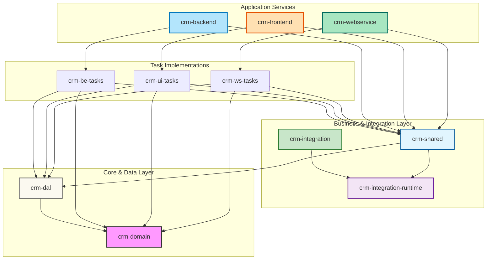

# Sunrise CRM Project

This project follows a clean architectural pattern designed for a complex telecom CRM system, ensuring clear boundaries and high maintainability.

## Project Structure

The project is organized into several Maven modules, each with a specific responsibility:

### 1. `crm-domain` (The Core)
* **Responsibility:** Pure business logic, Records, and Interfaces.
* **Contents:** `Order`, `LineItem`, `OrderAttribute`, and `OrderRepository` **Interface**.
* **Dependencies:** None (Zero-dependency).
* **Docs:** [project-specification.md](file:///c:/dev/sunrise/crm-domain/docs/project-specification.md)

### 2. `crm-dal` (Data Access Layer)
* **Responsibility:** Bridging the Domain to the Database.
* **Sub-modules:**
    * `crm-dal-generated`: Automated JPA Entity generation from the DB schema.
    * `crm-dal-runtime`: Repository implementations and Spring Data logic.
    * `crm-cache`: Caching mechanisms.
* **Dependencies:** `crm-domain`.
* **Docs:** [project-specification.md](file:///c:/dev/sunrise/crm-dal/docs/project-specification.md)

### 3. `crm-integration` (External System Integration - Generated Code)
* **Responsibility:** Pure generated code from WSDL/OpenAPI specifications for connections to external systems.
* **Contents:** Generated integration clients (REST, SOAP, messaging), pure Java with no framework dependencies.
* **Dependencies:** `crm-integration-runtime`.
* **Docs:** [project-specification.md](file:///c:/dev/sunrise/crm-integration/docs/project-specification.md)

### 4. `crm-integration-runtime` (Integration Runtime Support)
* **Responsibility:** Runtime infrastructure for external system integrations.
* **Contents:** WebClient configuration, authentication strategies, retry logic, circuit breaker patterns.
* **Dependencies:** `spring-boot-starter-webflux`, `resilience4j`.
* **Docs:** [project-specification.md](file:///c:/dev/sunrise/crm-integration-runtime/docs/project-specification.md)

### 5. `crm-shared` (Shared Business Layer)
* **Responsibility:** Shared business operations and transport layer for all service endpoints.
* **Contents:** Shared DTOs, business operation utilities, transaction handling.
* **Dependencies:** `crm-dal` (transitively `crm-domain`), `crm-integration-runtime`.
* **Docs:** [project-specification.md](file:///c:/dev/sunrise/crm-shared/docs/project-specification.md)

### 6. `crm-be-tasks` (Business Task Workers)
* **Responsibility:** Pure Java business task implementations and orchestration for Camunda workflows.
* **Contents:** Collection of `JobWorkerServiceBase` implementations for business operations like credit checking, email sending, etc.
* **Dependencies:** `crm-shared`, `crm-domain`, `crm-dal`.
* **Docs:** [project-specification.md](file:///c:/dev/sunrise/crm-be-tasks/docs/project-specification.md)

### 7. `crm-backend` (Camunda/Zeebe Integration)
* **Responsibility:** Zeebe job worker bridge connecting Camunda BPMN processes to business tasks.
* **Contents:** `CamundaTaskWorker` that delegates Zeebe jobs to `crm-be-tasks` workers.
* **Dependencies:** `crm-shared`, `crm-be-tasks`.
* **Docs:** [project-specification.md](file:///c:/dev/sunrise/crm-backend/docs/project-specification.md)

### 8. `crm-ws-tasks` (Web Service Tasks)
* **Responsibility:** Pure Java web service task implementations for REST API operations.
* **Contents:** Collection of `WebServiceTaskBase` implementations for web service operations like customer lookup, order updates, etc.
* **Dependencies:** `crm-shared`, `crm-domain`, `crm-dal`.
* **Docs:** [project-specification.md](file:///c:/dev/sunrise/crm-ws-tasks/docs/project-specification.md)

### 9. `crm-webservice` (REST API Service)
* **Responsibility:** REST API interface providing generic endpoints for web service operations.
* **Contents:** `CrmWebServiceController` with read-only and transactional read-write endpoints that delegate to `crm-ws-tasks`.
* **Dependencies:** `crm-shared`, `crm-ws-tasks`.
* **Docs:** [project-specification.md](file:///c:/dev/sunrise/crm-webservice/docs/project-specification.md)

### 10. `crm-ui-tasks` (UI Tasks)
* **Responsibility:** Pure Java UI task implementations for web interface operations.
* **Contents:** Collection of `UITaskBase` implementations for UI operations like dashboard data, form processing, etc.
* **Dependencies:** `crm-shared`, `crm-domain`, `crm-dal`.
* **Docs:** [project-specification.md](file:///c:/dev/sunrise/crm-ui-tasks/docs/project-specification.md)

### 11. `crm-frontend` (Web UI Service)
* **Responsibility:** Web UI interface providing pages and forms for CRM operations.
* **Contents:** `CrmFrontendController` with web endpoints that delegate to `crm-ui-tasks` and render Thymeleaf templates.
* **Dependencies:** `crm-shared`, `crm-ui-tasks`.
* **Docs:** [project-specification.md](file:///c:/dev/sunrise/crm-frontend/docs/project-specification.md)

---

## Supporting Resources

### `camunda-process`
* **Responsibility:** BPMN process definitions for Camunda/Zeebe workflows.
* **Contents:** BPMN XML files defining business processes and task flows.

### `docs`
* **Responsibility:** Project-level documentation and architecture guides.
* **Contents:** Overall architecture walkthrough and design decisions.

---

## Dependency Diagram



---

## Architectural Principles

### Pure Domain
The `crm-domain` module remains a "Pure Java" project. This is critical for keeping business logic decoupled from infrastructure concerns like Hibernate or Spring Data.

### Pure Business Tasks
`crm-be-tasks` contains pure Java business task implementations with no Camunda/Zeebe dependencies. Each task extends `JobWorkerServiceBase` and implements business logic only.

### Camunda Integration Bridge
`crm-backend` provides the Zeebe job worker bridge that connects Camunda BPMN processes to business tasks. It handles Zeebe-specific concerns while delegating business logic to `crm-be-tasks`.

### Shared Business Layer
`crm-shared` provides the business operations and shared transport layer used across all service interfaces (REST API, Web UI, Camunda). It depends on both `crm-dal` for data access and `crm-integration-runtime` for external system connectivity. This ensures consistency in data transfer objects, business logic, and integration handling.

### Integration Architecture
`crm-integration` contains pure generated code from API specifications (WSDL, OpenAPI). `crm-integration-runtime` provides the infrastructure: WebClient configuration, authentication strategies, retry policies, and circuit breaker patterns. This separation ensures generated code remains clean and changes to specifications don't require runtime modifications.

### Web Service REST API
`crm-webservice` provides a REST API interface that delegates to `crm-ws-tasks` implementations. This allows external clients to invoke business logic directly via HTTP without Camunda workflows, while maintaining the same clean separation of concerns.

### Web UI Interface
`crm-frontend` provides a web UI interface that delegates to `crm-ui-tasks` implementations. This offers traditional web pages and forms for user interaction, complementing the REST API approach.

### Pure Task Implementations
Both `crm-ws-tasks` and `crm-ui-tasks` contain pure Java task implementations with no infrastructure dependencies. Each follows the same pattern as Camunda tasks but for different consumption models.

### Mappers and Repositories
Data mapping (MapStruct) and Repository implementations reside in `crm-dal`, keeping the `crm-domain` unaware of database-specific details.

### Business Orchestration
`crm-be-tasks` handles complex operations that require multiple domain objects or external data enrichment, isolating orchestration from core business rules and Camunda infrastructure.

### Transactional Entry Points
Each adapter module (`crm-backend`, `crm-webservice`, `crm-frontend`) defines its own abstract base class that owns the `@Transactional` boundary via a template method. Task implementations in `crm-*-tasks` extend this base and implement pure business logic with no transaction awareness. This enforces the transaction boundary structurally rather than by convention, and allows each channel to handle its own post-commit concerns — Zeebe `complete()`/`fail()` in `crm-backend`, HTTP response mapping in `crm-webservice`, and view rendering in `crm-frontend` — without any of that leaking into task logic.

---

## Getting Started

1. **Build the master project:**
   ```bash
   mvn clean install
   ```

2. **Run the Backend Worker (Processing Camunda Jobs):**
   Navigate to `crm-backend` and run the Spring Boot application to process Zeebe jobs from Camunda workflows.

   ```bash
   cd crm-backend
   mvn spring-boot:run
   ```

   The application will connect to Camunda and process jobs as they are created by BPMN processes.

3. **Run the Web Service API (Direct REST Access):**
   Navigate to `crm-webservice` and run the Spring Boot application to provide REST API access to business logic.

   ```bash
   cd crm-webservice
   mvn spring-boot:run
   ```

   The REST API will be available at `http://localhost:8083/api/ws/`

4. **Run the Web UI (Traditional Web Interface):**
   Navigate to `crm-frontend` and run the Spring Boot application to provide web UI access.

   ```bash
   cd crm-frontend
   mvn spring-boot:run
   ```

   The web UI will be available at `http://localhost:8084/ui/`

5. **Deploy BPMN Processes:**
   Use the BPMN process files in `camunda-process/` directory to deploy workflows to your Camunda instance.
