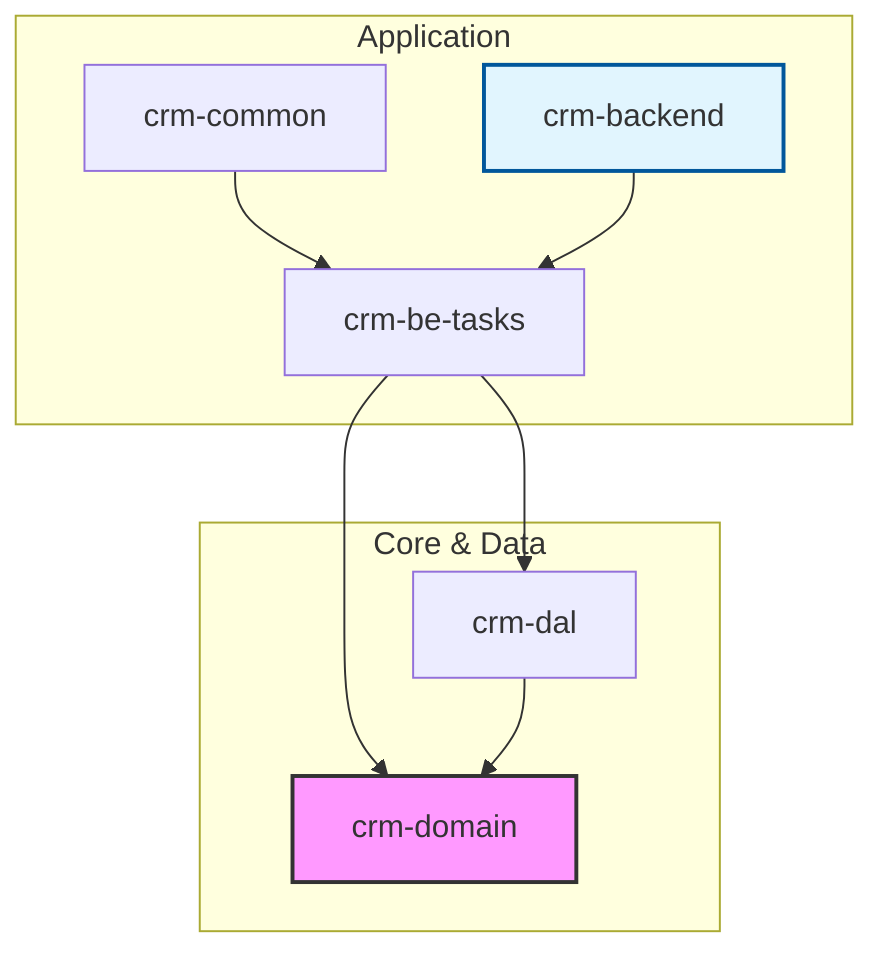

# Sunrise CRM Project

This project follows a clean architectural pattern designed for a complex telecom CRM system, ensuring clear boundaries and high maintainability.

## Project Structure

The project is organized into several Maven modules, each with a specific responsibility:

### 1. `crm-domain` (The Core)
* **Responsibility:** Pure business logic, Records, and Interfaces.
* **Contents:** `Order`, `LineItem`, `OrderAttribute`, and `OrderRepository` **Interface**.
* **Dependencies:** None (Zero-dependency).
* **Docs:** [project-specification.md](file:///c:/dev/sunrise/crm-domain/docs/project-specification.md)

### 2. `crm-dal` (Data Access Layer)
* **Responsibility:** Bridging the Domain to the Database.
* **Sub-modules:**
    * `crm-dal-generated`: Automated JPA Entity generation from the DB schema.
    * `crm-dal-runtime`: Repository implementations and Spring Data logic.
    * `crm-cache`: Caching mechanisms.
* **Dependencies:** `crm-domain`.
* **Docs:** [project-specification.md](file:///c:/dev/sunrise/crm-dal/docs/project-specification.md)

### 3. `crm-be-tasks` (Business Task Workers)
* **Responsibility:** Pure Java business task implementations and orchestration.
* **Contents:** Collection of `JobWorkerServiceBase` implementations for business operations like credit checking, email sending, etc.
* **Dependencies:** `crm-domain`, `crm-dal`.
* **Docs:** [project-specification.md](file:///c:/dev/sunrise/crm-be-tasks/docs/project-specification.md)

### 4. `crm-backend` (Camunda Integration)
* **Responsibility:** Zeebe job worker bridge connecting Camunda BPMN processes to business tasks.
* **Contents:** `CamundaTaskWorker` that delegates Zeebe jobs to `crm-be-tasks` workers.
* **Dependencies:** `crm-be-tasks`.
* **Docs:** [project-specification.md](file:///c:/dev/sunrise/crm-backend/docs/project-specification.md)

### 4. `crm-common` (Service Entry Point)
* **Responsibility:** Transport layer.
* **Contents:** REST Controllers, gRPC stubs, and DTOs for the external world.
* **Dependencies:** `crm-be-tasks`.
* **Docs:** [project-specification.md](file:///c:/dev/sunrise/crm-common/docs/project-specification.md)

### 6. `crm-camunda` (The Runtime)
* **Responsibility:** The Spring Boot wrapper that manages the Camunda Process Engine.
* **Dependencies:** none (calls `crm-be-tasks` via REST/gRPC).
* **Docs:** [project-specification.md](file:///c:/dev/sunrise/crm-camunda/docs/project-specification.md)

---

## Dependency Diagram



---

## Architectural Principles

### Pure Domain
The `crm-domain` module remains a "Pure Java" project. This is critical for keeping business logic decoupled from infrastructure concerns like Hibernate or Spring Data.

### Pure Business Tasks
`crm-be-tasks` contains pure Java business task implementations with no Camunda/Zeebe dependencies. Each task extends `JobWorkerServiceBase` and implements business logic only.

### Camunda Integration Bridge
`crm-backend` provides the Zeebe job worker bridge that connects Camunda BPMN processes to business tasks. It handles Zeebe-specific concerns while delegating business logic to `crm-be-tasks`.

### Mappers and Repositories
Data mapping (MapStruct) and Repository implementations reside in `crm-dal`, keeping the `crm-domain` unaware of database-specific details.

### Business Orchestration
`crm-be-tasks` handles complex operations that require multiple domain objects or external data enrichment, isolating orchestration from core business rules and Camunda infrastructure.

---

## Getting Started

1. **Build the master project:**
   ```bash
   mvn clean install
   ```
2. **Run the Camunda application:**
   Navigate to `crm-camunda` and run the Spring Boot application.

3. **Run the Backend Worker (Alternative):**
   Navigate to `crm-backend` and run the Spring Boot application to process Zeebe jobs.

Would you like to start with the main `Order` DTO?